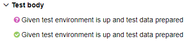

Extended Allure Listener for Kotest
=================================

[](https://www.oracle.com/java/technologies/javase-jdk11-downloads.html)
[](https://github.com/JetBrains/kotlin)
[](https://gradle.org/)

[](http://search.maven.org/#search|ga|1|kotest-allure)

# Quick Start

[Sample project](https://github.com/kochetkov-ma/pump-samples/tree/master/kotest-allure-sample)

### Add dependencies

```groovy
dependencies {
    testImplementation "ru.iopump.kotest:kotest-allure:5.6.2"

    // Kotest deps https://github.com/kotest/kotest/blob/master/doc/reference.md#getting-started
    testImplementation 'io.kotest:kotest-runner-junit5-jvm:<version>'
    // For Kotest framework with transitives 'core' and 'common'
}
```

Allure `TestListener` (and `Extension`) has annotation `@AutoScan` that's why not necessary to enable this Listener
explicitly.  
Also, it provides necessary `allure common libs` but doesn't offer Kotest dependency.

### Results

By default, results were collected to `./build/allure-results`.  
You can override it by system property `-Dallure.results.directory=...`.  
Or via gradle script:

```groovy
test {
    systemProperty "allure.results.directory", file("$buildDir/allure-results")
    useJUnitPlatform()
}
```

### Reports

Use gradle [allure plugin](https://github.com/allure-framework/allure-gradle) to generate report.

```groovy
plugins {
    id "io.qameta.allure" version "$allurePluginVersion"
}
allure {
    version = allureVersion
    autoconfigure = false
    aspectjweaver = true
    aspectjVersion = aspectJVersion
    resultsDir = file "$buildDir/allure-results"
}
``` 

See [example](https://github.com/kochetkov-ma/pump-samples/tree/master/kotest-allure-sample)

## API

### Annotations

#### `@KDescription`

Specify test case description through this annotation with markdown text.

```kotlin
@KDescription(
    """
    This is multiline description.
    It must be a new line
"""
)
class ExampleBddSpec : BehaviorSpec() 
```

#### `@KJira`

Set link to Jira issue (not defect). You must adjust jira link pattern before by `allure.link.jira.pattern` variable.  
The best way is `allure.properties` in resource dir (or classpath)  
allure.properties:

```properties
allure.link.issue.pattern=https://example.org/issue/{}
allure.link.tms.pattern=https://example.org/tms/{}
allure.link.jira.pattern=https://example.org/jira/{}
```  

Code:

```kotlin
@KJiras(
    value = [KJira("TTT-111"), KJira("TTT-000")]
)
class ExampleBddSpec : BehaviorSpec()
```

#### `@KJiras`

Repeatable (annotation container) version of `KJira` annotation

#### `@KAllureId` ⚡NEW⚡ (see `Links in test name > AllureID`)

The same as `@AllureId` but `@Target(AnnotationTarget.CLASS)`. It means to use it on specification class

Code:

```kotlin
@KAllureId(value = "1")
class ExampleDataDrivenSpec : FreeSpec()
```

### Links in test name

#### Task management system link (like `Jira`) 
You may specify jira link in a test name and even nested test name. Link must be matches with
pattern `\[([a-zA-Z]+-\d+)]`.  Like `"Test name [PRJ-100]" { ... }`

Use system variable `allure.jira.pattern` to override it.

```kotlin
class ExampleBddSpec : BehaviorSpec({
    Given("[PRJ-100] Start kotest specification Scenario") { println("...") }
})
```
or `String.task()` extension ⚡NEW⚡
```kotlin
class ExampleBddSpec : BehaviorSpec({
    Given("Start kotest specification Scenario".task("PRJ-100")) { println("...") }
})
```

`[PRJ-100]` consider as Jira link with key `PRJ-100` don't forget to define `allure.link.jira.pattern`
in `allure.properties`

#### Test Management System link (like `Zephyr` / `XRay` / `TestRail`)
Specify TMS link in a test name and even nested test name. Link must be matches with
pattern `\(([a-zA-Z]+-\d+)\)`. Like `"Test name (TC-100)" { ... }`

Use system variable `allure.tms.pattern` to override it.

```kotlin
class ExampleBddSpec : FreeSpec({
    "[PRJ-100](TC-100) Start kotest specification Scenario" - { println("...") }
})
```
or `String.tms()` extension ⚡NEW⚡
```kotlin
class ExampleBddSpec : FreeSpec({
    "[PRJ-100] Start kotest specification Scenario".tms("TC-100") - { println("...") }
})
```

`[TC-100]` consider as TMS link with key `TC-100` don't forget to define `allure.link.tms.pattern`
in `allure.properties`

#### [AllureID `TestOps`](https://qameta.io/) ⚡NEW⚡
Specify [`ALLURE ID`]((https://qameta.io/)) link in a test name and even nested test name. Link must be matches with
pattern `#(\d+)`. Like `"Test name #777" { ... }`

Use system variable `allure.id.pattern` to override it.

```kotlin
class ExampleBddSpec : FreeSpec({
    "#777[PRJ-100](TC-100) Start kotest specification Scenario" - { println("...") }
})
```
or `String.allureId()` extension
```kotlin
class ExampleBddSpec : FreeSpec({
    "[PRJ-100] Start kotest specification Scenario".tms("TC-100").allureId("777") - { println("...") }
})
```

`777` consider as [`ALLURE ID`]((https://qameta.io/)) label with key `777`.
## Other features

See main feature above

### Intercepting all Allure messages

Every `step` and `attachment` will be intercept and post to Sl4j logger by `ru.iopump.kotest.Slf4jAllureLifecycle`
`step` messages have an INFO level. `attachment` messages have an DEBUG level.  
This feature enabled by default.  
You may disable by system env `allure.slf4j.log`.

### Skip following nested scenarios on fail

If Test Case has nested scenarios and any of them will fail then follows ones will fail too with
exception `TestAbortedException`
This feature enabled by default.  
You may disable by system env `kotest.allure.skip.on.fail`.

### Clean allure results on start

Allure results directory specified by system env `allure.results.directory` will be removed on tet project start. This
feature disabled by default.  
You may enable by system env `allure.results.directory.clear`.

### Clean up allure metadata from `Test Names` ⚡NEW⚡
```kotlin
class ExampleDataDrivenSpec : FreeSpec({
        "Scenario [J-100] (T-3) #999" - { }
    })
```
will be without `[J-100] (T-3) #999` in report

  


But, if some unexpected result you may disable it by `kotest.allure.meta.cleanup` system or env variable

## Settings

There is a full setting table. All settings adjust by system variable:

| Name                           | Description                                                                                                                                                           | Default                |
|--------------------------------|-----------------------------------------------------------------------------------------------------------------------------------------------------------------------|------------------------|
| allure.jira.pattern            | see [Links in test name](#links-in-test-name)                                                                                                                         | \[([a-zA-Z]+-\d+)]     |
| allure.results.directory       | path to write results during the test                                                                                                                                 | ./build/allure-results |
| allure.results.directory.clear | clean result directory before whole test execution                                                                                                                    | true                   |
| kotest.allure.skip.on.fail     | skip follow nested (not root tests) scenarios or steps on fail                                                                                                        | true                   |
| allure.slf4j.log               | duplicate allure step and attachment messages to Slf4j Logger                                                                                                         | true                   |
| allure.lifecycle.class         | Set `AllureLifecycle` full class name                                                                                                                                 | `ru.iopump.kotest.allure.api.Slf4JAllureLifecycle`|
| kotest.allure.data.driven      | Create new Allure test case on each new iteration in Data Driven tests or Property Testing                                                                            | true |
| kotest.allure.step.shouldThrow ⚡NEW⚡     | Doesn't break test if step throws exception in shouldThrow block                                                                                                        | true |
| kotest.allure.meta.cleanup ⚡NEW⚡     | Clean all allure metadata (issue, tms, allureId) from test case name. `"My test name [JIRA-1](TMS-2)#3 - { ... }` - will be cleaned up to `"My test name"` in report. | true |

All variables are very flexible, for example: `allure.jira.pattern` == `allure_jira_pattern` == `ALLURE.JIRA.PATTERN` == `ALLURE_JIRA_PATTERN` as `ENV` or `SYS` variable

# Public report example

- See example generated report on [allure.iopump.ru](http://allure.iopump.ru/reports/kotest-allure)
- [Sample project](https://github.com/kochetkov-ma/pump-samples/tree/master/kotest-allure-sample)

# Troubleshooting

### Duplicated steps



Because the listener has annotation `@AutoScan` it can be duplicated when you specify it in Configuration like this:

```kotlin
// Main functions as Listener
override fun listeners(): List<Listener> = listOf(
    KotestAllureListener
)

// Support skipped test step as Extension
override fun extensions(): List<Extension> = listOf(
    KotestAllureListener
)
```

> For support to display skipped test step in report KotestAllureListener also implement Extension `interface`

You should delete `KotestAllureListener` or other Allure Listeners from any configuration classes. Check you
dependencies - it must contain the only allure extension `ru.iopump.kotest:kotest-allure`

### Redundant TestCases in Report

If you're using Allure Gradle Plugin it can automatically add JUnit Listener. We don't need it for Kotest Engine. You should disable it:
```groovy
allure {
    adapter {
        frameworks {
            junit5 {
                enabled = false
            }
        }
    }
}
```